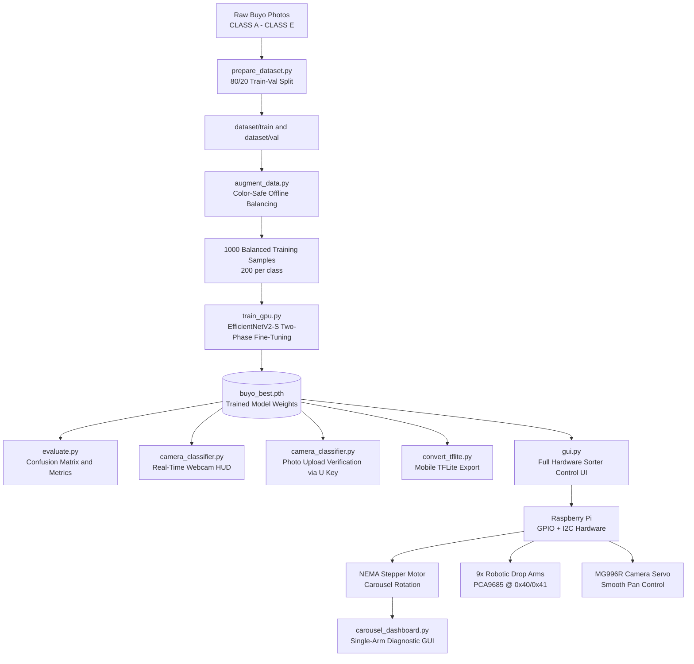

# 🍃 Buyo Leaf Quality Classifier & Automated Sorter (Class A – Class E)

[](https://github.com/jkabonita/Buyo-Leaf-Classifier.git)
[](https://www.python.org/)
[](https://pytorch.org/)
[](https://developer.nvidia.com/cuda-zone)
[](https://opencv.org/)
[](https://www.tensorflow.org/lite)
[](https://www.raspberrypi.org/)
[](LICENSE)

An **end-to-end, GPU-accelerated Computer Vision and Deep Learning system** for automated grading, quality assessment, and **physical sorting** of **Buyo (Betel) leaves** into five market grades: **Class A, Class B, Class C, Class D, and Class E**.

The system spans the complete pipeline — from deep learning model training on a Windows GPU workstation to real-time inference and **physical hardware control on a Raspberry Pi**, driving a motorized rotary carousel sorter with 9 robotic drop arms, a stepper motor conveyor, and servo-driven camera positioning.

---

## 🛠️ Complete Tech Stack & Frameworks

| Category | Technology / Framework | Role in Project |
| :--- | :--- | :--- |
| **Core Language** | **Python 3.12** | Core programming language for all pipelines, training, inference, and hardware control. |
| **Deep Learning Framework** | **PyTorch 2.6.0+cu124** | Model architecture, differential optimization, loss computation, and GPU tensor execution. |
| **Vision Models** | **TorchVision 0.21.0** | Pretrained **EfficientNetV2-S (IMAGENET1K_V1)**, MobileNetV2, and transforms pipeline. |
| **Edge / Mobile ML** | **TensorFlow / Keras / TFLite** | Legacy training pipeline and mobile .tflite model conversion for Android/embedded deployment. |
| **Computer Vision** | **OpenCV 4.10+** | Real-time video capture, HUD sidebar rendering, frame resizing, and color space conversions. |
| **Image Processing** | **Pillow 10.4+** | High-fidelity image decoding, offline augmentations, and affine transformations. |
| **Numerical Computing** | **NumPy & SciPy** | Matrix operations, rolling temporal probability smoothing, and array manipulations. |
| **Evaluation & Metrics** | **Scikit-Learn** | Classification reports, weighted Precision/Recall/F1 metrics, and confusion matrix computation. |
| **Visualization** | **Seaborn & Matplotlib** | High-resolution confusion matrix heatmaps and training curves. |
| **GUI & Dialogs** | **Tkinter (tkinter, ttk)** | Native OS file picker dialog, system diagnostics dashboard, and hardware control UI. |
| **Hardware Acceleration** | **NVIDIA CUDA 12.4 + cuDNN** | GPU-accelerated training and sub-millisecond real-time inference. |
| **Embedded Hardware** | **Raspberry Pi + RPi.GPIO** | GPIO control for NEMA stepper motor (DRV8825/A4988) — step, direction, and enable signals. |
| **Servo Control** | **Adafruit ServoKit + PCA9685** | I2C PWM driver for MG996R camera servo (0x40) and 9-channel robotic drop arm board (0x41). |
| **I2C Communication** | **smbus2** | Hardware probing and I2C device detection on Raspberry Pi. |

---

## 📐 Full System Pipeline Architecture



---

## 🗂️ Buyo Leaf Grading Scale

| Grade | Market Designation | Visual & Physical Characteristics |
| :---: | :--- | :--- |
| **Class A** | **Export / Premium Grade** | Vibrant, uniform deep green, intact heart shape, zero spots, smooth texture. |
| **Class B** | **High Grade** | Fresh green, minor surface irregularities, very minimal edge discoloration. |
| **Class C** | **Standard Grade** | Slight yellowing, minor tears, mild speckling or vein discoloration. |
| **Class D** | **Low / Industrial Grade** | Visible yellow-brown patches, noticeable blemishes, irregular shape. |
| **Class E** | **Reject / Damaged** | Severe blemishes, heavy browning, significant tears or insect damage. |

---

## 📁 Repository Structure

```
Buyo-Leaf-Classifier/
├── CLASS A/                   # Raw Class A images (Premium/Export)
├── CLASS B/                   # Raw Class B images (High Grade)
├── CLASS C/                   # Raw Class C images (Standard)
├── CLASS D/                   # Raw Class D images (Low Grade)
├── CLASS E/                   # Raw Class E images (Reject/Damaged)
├── dataset/                   # Auto-generated train/val splits
│   ├── train/                 # 80% split — augmented & balanced (1,000 images)
│   └── val/                   # 20% split — validation set
├── augment_data.py            # Offline color-safe augmentation & dataset balancer
├── prepare_dataset.py         # Splits raw images into train/val folders (80/20)
├── train_gpu.py               # PyTorch GPU training — EfficientNetV2-S two-phase fine-tuning
├── train.py                   # Alternative / baseline training script
├── evaluate.py                # Validation evaluator & confusion matrix generator
├── camera_classifier.py       # Live webcam HUD & photo upload verification GUI
├── gui.py                     # Full hardware sorter control UI (9-arm, multi-carousel)
├── carousel_dashboard.py      # Single-arm Carousel & System Diagnostics GUI (Raspberry Pi)
├── convert_tflite.py          # Mobile TFLite model converter
├── test_inference.py          # Quick single-image inference verification script
├── confusion_matrix.png       # Generated validation confusion matrix heatmap
├── buyo_best.pth              # Best trained model checkpoint (EfficientNetV2-S)
├── buyo_classifier_5class.keras   # TensorFlow/Keras model
├── buyo_classifier_5class.tflite  # TFLite mobile model
├── buyo_pytorch.pth           # Fallback MobileNetV2 model checkpoint
├── requirements.txt           # Python dependencies
├── .gitignore                 # Excludes heavy binaries & reproducible artifacts
└── README.md                  # Project documentation
```

---

## ⚙️ Quickstart & Reproducibility Guide

### 1. Clone the Repository
```bash
git clone https://github.com/jkabonita/Buyo-Leaf-Classifier.git
cd Buyo-Leaf-Classifier
```

### 2. Environment Setup (Python 3.12)
```powershell
python -m venv ml_env
.\ml_env\Scripts\Activate.ps1
```

### 3. Install Dependencies
```powershell
# Install PyTorch with CUDA 12.4 support
pip install torch torchvision --index-url https://download.pytorch.org/whl/cu124

# Install remaining libraries
pip install -r requirements.txt
```

---

## 🚀 Step-by-Step Execution

### Step 1: Prepare Train/Val Split
Splits the raw CLASS A through CLASS E folders into dataset/train and dataset/val with an 80/20 ratio:
```powershell
python prepare_dataset.py
```

### Step 2: Expand & Balance Dataset (Offline Augmentation)
Generates color-safe synthetic samples for underrepresented classes, expanding the training dataset to **1,000 balanced images** (200 per class):
```powershell
python augment_data.py
```

### Step 3: Train the EfficientNetV2-S Model on GPU
Two-phase fine-tuning on CUDA with Mixup augmentation, WeightedRandomSampler, and CosineAnnealingWarmRestarts:
```powershell
python train_gpu.py
```
*The best weights are automatically saved to `buyo_best.pth` with ONNX export.*

### Step 4: Evaluate Model Performance
Runs validation on test images and produces detailed metrics and a confusion matrix heatmap:
```powershell
python evaluate.py
```

### Step 5: Launch Real-Time Camera & Photo Classifier
```powershell
python camera_classifier.py
```

### Step 6: Launch Hardware Sorter Control UI (Raspberry Pi)
Full multi-arm carousel control, per-arm calibration, and automated sort cycle:
```powershell
python gui.py
```

### Step 7: Launch Carousel Diagnostics Dashboard (Raspberry Pi)
Lightweight diagnostic GUI for single-arm testing and peripheral health checks:
```powershell
# On Raspberry Pi
python carousel_dashboard.py

# Headless / Windows development (mock mode — no GPIO required)
python carousel_dashboard.py --mock
```

---

## 🎮 Classifier GUI Controls

When running `camera_classifier.py`:

| Key | Mode | Function |
| :---: | :---: | :--- |
| **`U`** | **Photo Upload** | Pauses video feed and opens a native file dialog to select any image from disk for instant grading. |
| **`S`** | **Screenshot** | Captures the current camera frame with HUD overlay and saves it as `screenshot_xxx.jpg`. |
| **`Q`** | **Exit** | Closes the photo inspection window or terminates the application. |

---

## 🤖 Hardware Sorter GUI — `gui.py`

The full production Raspberry Pi control interface for the multi-arm rotary sorter:

| Feature | Description |
| :--- | :--- |
| **9-Arm Multi-Sort** | Controls 9 independently-addressable robotic drop arms via PCA9685 (0x40). |
| **Per-Arm Calibration** | Stores and persists exact per-arm, per-class disk step positions to `calibration.json`. |
| **Open-Loop Positioning** | 5-sector carousel with 57,804-step full revolution; no homing sensor required. |
| **Automated Sort Cycle** | AI scan results drive disk rotation and drop arm sequence automatically. |
| **Simulation Mode** | Test the complete sort logic with pre-defined class assignments — no live camera needed. |
| **Calibration Persistence** | JSON-based calibration file restores disk position and arm offsets across sessions. |

---

## 🎛️ Carousel Dashboard — `carousel_dashboard.py`

A lightweight Tkinter diagnostic GUI for single-arm carousel testing on Raspberry Pi:

| Feature | Description |
| :--- | :--- |
| **Peripheral Status Panel** | Live I2C probing for PCA9685 (0x40/0x41), GPIO stepper state, and CSI camera `/dev/video0`. |
| **Direct Bin Indexing** | One-click navigation to any Class A–E bin station with real-time step telemetry. |
| **Sort Cycle Automation** | Dispatch to bin → dwell (1.2 s) → auto-return to Class A origin sequence. |
| **Full Carousel Sweep** | Visits all 5 bin stations sequentially and returns to origin for mechanical testing. |
| **Camera Servo Diagnostics** | Smooth pan test sequence: centre → left (35°) → right (145°) → centre, with PWM release. |
| **Safe Shutdown** | Returns carousel to Class A origin and releases all GPIO before closing. |
| **Mock Mode** | `--mock` flag stubs all GPIO/I2C calls for off-Pi development and testing. |

---

## 🔬 Model Training & Optimization Details

### Architecture: EfficientNetV2-S (Two-Phase Fine-Tuning)

| Phase | Epochs | Strategy | Learning Rate | Augmentation |
| :---: | :---: | :--- | :--- | :--- |
| **Phase 1** | 20 | Frozen backbone — head only | `1e-3` | Standard transforms |
| **Phase 2** | 80 | Full unfreeze — end-to-end | `1e-5` | Heavy online augmentation + Mixup (alpha=0.4) |

### Key Training Techniques
- **Backbone**: `EfficientNetV2-S` initialized with `IMAGENET1K_V1` weights.
- **Class Balancing**: `WeightedRandomSampler` + weighted `CrossEntropyLoss` based on per-class frequency.
- **Gradient Clipping**: `max_norm=1.0` to prevent exploding gradients during full fine-tune.
- **Early Stopping**: Patience of 20 epochs in Phase 2; auto-stops at ≥99% validation accuracy.
- **Scheduler**: `CosineAnnealingWarmRestarts` (T0=20, T_mult=2) for escape from local minima.
- **Online Augmentation**: Random crop, flip, rotation (±45°), ColorJitter, RandomGrayscale, RandomErasing.
- **Export**: ONNX export (opset_version=11) generated automatically after training.

### Real-Time Inference
- **Temporal Filter**: 7-frame rolling average buffer (deque) on real-time logits to eliminate jitter.
- **Confidence Threshold**: Predictions below 55% display `???` with an alignment hint.
- **Fallback Model**: `buyo_pytorch.pth` (MobileNetV2) if primary checkpoint is unavailable.

---

## ⚙️ Hardware Configuration (Raspberry Pi)

### Stepper Motor (NEMA — DRV8825 / A4988)

| GPIO Pin | BCM Number | Function |
| :---: | :---: | :--- |
| DIR | GPIO 27 | Rotation direction |
| STEP | GPIO 17 | Step pulse |
| EN | GPIO 22 | Driver enable (Active LOW) |

### Bin Station Step Calibration

| Station | Absolute Steps | Note |
| :---: | :---: | :--- |
| Class A | 0 | Origin |
| Class B | 9,677 | — |
| Class C | 22,644 | — |
| Class D | 35,664 | +5% offset applied |
| Class E | 47,804 | — |
| Full Revolution | ~57,804 | 9 arms × ~6,423 steps/arm |

### Servo & I2C Channels

| Device | I2C Address | Channel | Pulse Range |
| :--- | :---: | :---: | :--- |
| MG996R Camera Servo | 0x40 | Ch 15 | 500–2,500 µs |
| Robotic Arms 1–9 | 0x40 | Ch 3,2,1,0,8,7,6,5,4 | Standard 180° |
| Secondary Driver | 0x41 | Optional | — |

---

## 📄 License

Distributed under the [MIT License](LICENSE).
