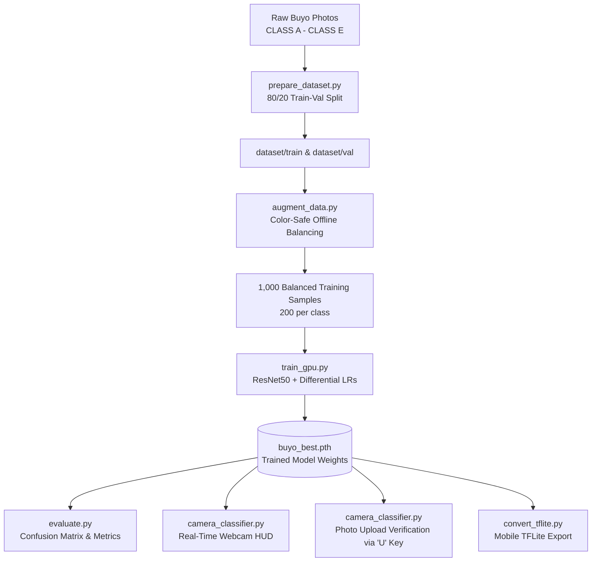

# 🍃 Buyo Leaf Quality Classifier (Class A – Class E)

[](https://github.com/jkabonita/Buyo-Leaf-Classifier.git)
[](https://www.python.org/)
[](https://pytorch.org/)
[](https://developer.nvidia.com/cuda-zone)
[](https://opencv.org/)
[](https://www.tensorflow.org/lite)
[](LICENSE)

An end-to-end, GPU-accelerated Computer Vision and Deep Learning system for automated grading and quality assessment of **Buyo (Betel) leaves** into five market grades: **Class A, Class B, Class C, Class D, and Class E**.

Featuring **ResNet50 (`IMAGENET1K_V2`)** deep transfer learning, color-safe offline data balancing, comprehensive validation metrics with confusion matrices, real-time webcam inference with temporal smoothing, on-demand photo file verification via native file dialogs, and mobile TensorFlow Lite export capability.

---

## 🛠️ Complete Tech Stack & Frameworks

| Category | Technology / Framework | Role in Project |
| :--- | :--- | :--- |
| **Core Language** | **Python 3.12** | Core programming language for pipelines, training, and inference. |
| **Deep Learning Framework** | **PyTorch (`torch`) 2.6.0+cu124** | Model architecture definition, differential optimization, loss computation, and GPU tensor execution. |
| **Vision Models & Weights** | **TorchVision (`torchvision`) 0.21.0** | Pretrained **ResNet50 (`IMAGENET1K_V2`)**, EfficientNetV2-S, MobileNetV2, and transforms pipeline. |
| **Edge / Mobile ML** | **TensorFlow / Keras / TFLite** | Legacy training pipeline and mobile `.tflite` model conversion for Android/embedded deployment. |
| **Computer Vision** | **OpenCV (`cv2`) 4.10+** | Real-time video capture (`DirectShow`), HUD sidebar rendering, frame resizing, and color space conversions. |
| **Image Processing** | **Pillow (`PIL`) 10.4+** | High-fidelity image decoding, offline augmentations, and affine transformations. |
| **Numerical Computing** | **NumPy & SciPy** | Matrix operations, rolling temporal probability smoothing, and array manipulations. |
| **Evaluation & Metrics** | **Scikit-Learn (`sklearn`)** | Classification reports, weighted Precision/Recall/F1 metrics, and confusion matrix computation. |
| **Visualization & Plots** | **Seaborn & Matplotlib** | High-resolution confusion matrix heatmaps and training curves. |
| **GUI & Dialogs** | **Tkinter (`filedialog`)** | Native OS file picker dialog triggered from the camera classifier (`U` key). |
| **Hardware Acceleration** | **NVIDIA CUDA Toolkit 12.4 + cuDNN** | GPU-accelerated training and sub-millisecond real-time inference on NVIDIA RTX GPUs. |

---

## 📐 System Pipeline Architecture



---

## 🗂️ Buyo Leaf Grading Scale

| Grade | Market Designation | Visual & Physical Characteristics |
| :---: | :--- | :--- |
| **Class A** | **Export / Premium Grade** | Vibrant, uniform deep green, intact heart shape, zero spots, smooth texture. |
| **Class B** | **High Grade** | Fresh green, minor surface irregularities, very minimal edge discoloration. |
| **Class C** | **Standard Grade** | Slight yellowing, minor tears, mild speckling or vein discoloration. |
| **Class D** | **Low / Industrial Grade** | Visible yellow-brown patches, noticeable blemishes, irregular shape. |
| **Class E** | **Reject / Damaged** | Severe blemishes, heavy browning, significant tears or insect damage. |

---

## 📁 Repository Structure

```text
Buyo-Leaf-Classifier/
├── CLASS A/                   # Raw Class A images
├── CLASS B/                   # Raw Class B images
├── CLASS C/                   # Raw Class C images
├── CLASS D/                   # Raw Class D images
├── CLASS E/                   # Raw Class E images
├── augment_data.py            # Offline augmentation script (balances training set)
├── prepare_dataset.py         # Splits raw images into train/val folders
├── train_gpu.py               # PyTorch GPU fine-tuning pipeline (ResNet50 / AdamW)
├── train.py                   # Alternative / baseline training script
├── evaluate.py                # Validation evaluator & confusion matrix generator
├── camera_classifier.py       # Live camera HUD & photo upload verification GUI
├── convert_tflite.py          # Mobile TFLite model converter
├── test_inference.py          # Quick single-image inference verification script
├── confusion_matrix.png       # Generated validation confusion matrix heatmap
├── requirements.txt           # Python dependencies
├── .gitignore                 # Excludes heavy binaries & reproducible artifacts
└── README.md                  # Project documentation
```

---

## ⚙️ Quickstart & Reproducibility Guide

### 1. Clone the Repository
```bash
git clone https://github.com/jkabonita/Buyo-Leaf-Classifier.git
cd Buyo-Leaf-Classifier
```

### 2. Environment Setup (Python 3.12)
```powershell
python -m venv ml_env
.\ml_env\Scripts\Activate.ps1
```

### 3. Install Dependencies
```powershell
# Install PyTorch with CUDA 12.4 support
pip install torch torchvision --index-url https://download.pytorch.org/whl/cu124

# Install remaining libraries
pip install -r requirements.txt
```

---

## 🚀 Step-by-Step Execution

### Step 1: Prepare Train/Val Split
Splits the raw `CLASS A` through `CLASS E` folders into `dataset/train` and `dataset/val` with an 80/20 ratio:
```powershell
python prepare_dataset.py
```

### Step 2: Expand & Balance Dataset (Offline Augmentation)
Generates color-safe synthetic samples for underrepresented classes, expanding the training dataset to **1,000 balanced images** (200 per class):
```powershell
python augment_data.py
```

### Step 3: Train the ResNet50 Model on GPU
Fine-tunes ResNet50 on CUDA with differential learning rates, Cosine Annealing, and label smoothing:
```powershell
python train_gpu.py
```
*The best weights are automatically saved to `buyo_best.pth`.*

### Step 4: Evaluate Model Performance
Runs validation on test images and produces detailed metrics and a confusion matrix heatmap (`confusion_matrix.png`):
```powershell
python evaluate.py
```

### Step 5: Launch Real-Time Camera & Photo Classifier
```powershell
python camera_classifier.py
```

---

## 🎮 Classifier GUI Controls

When running `camera_classifier.py`:

| Key | Mode | Function |
| :---: | :---: | :--- |
| **`U`** | **Photo Upload** | Pauses video feed and opens a native file dialog to select any image from disk for instant grading. |
| **`S`** | **Screenshot** | Captures the current camera frame with HUD overlay and saves it as `screenshot_xxx.jpg`. |
| **`Q`** | **Exit** | Closes the photo inspection window or terminates the application. |

---

## 🔬 Model Training & Optimization Details

- **Backbone**: **ResNet50** initialized with `ResNet50_Weights.IMAGENET1K_V2`.
- **Differential Learning Rates**:
  - **Head**: `5e-4` (custom dense layers + dropout).
  - **Backbone**: `5e-5` (preserves pretrained visual feature extractors).
- **Loss Function**: Class-Weighted Cross-Entropy with `0.05` label smoothing.
- **Regularization**: Dual Dropout (`0.4` and `0.2`) on classification head.
- **Temporal Filter**: 7-frame rolling average buffer (`deque`) on real-time logits.
- **Confidence Threshold**: Predictions below `55%` trigger an alignment hint prompt.

---

## 📄 License

Distributed under the [MIT License](LICENSE).
